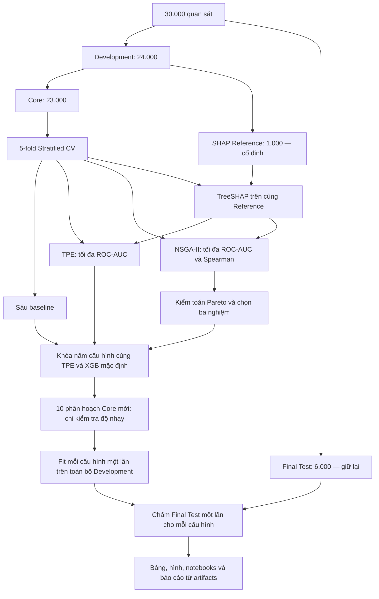
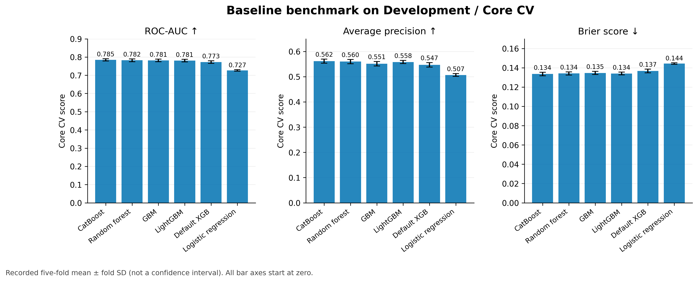
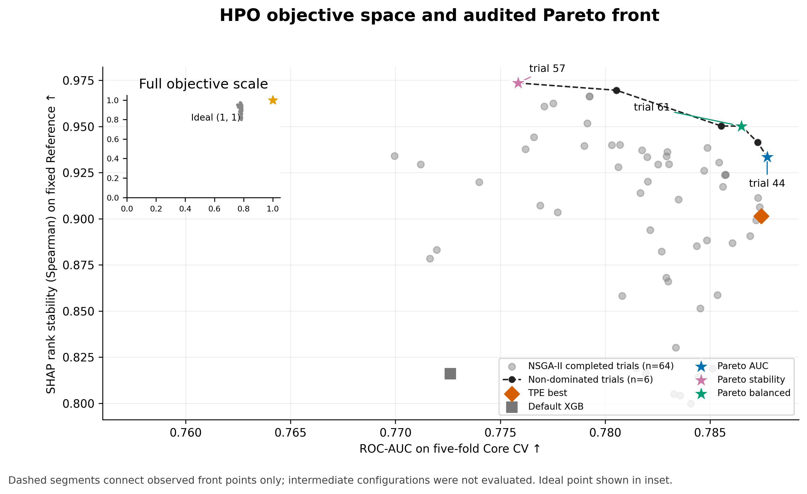
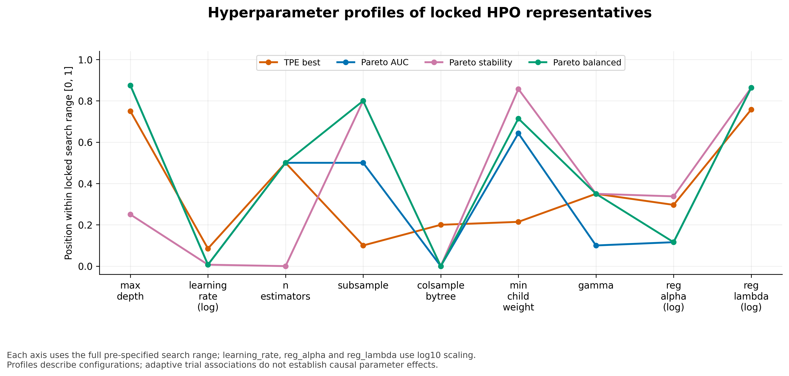
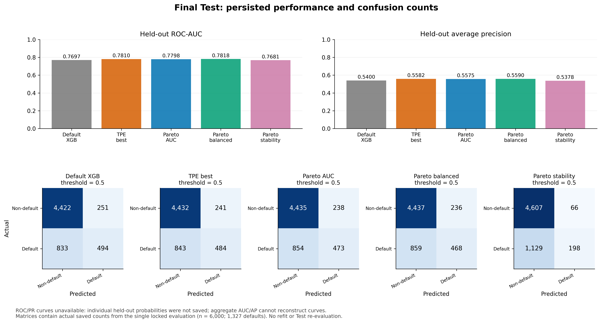
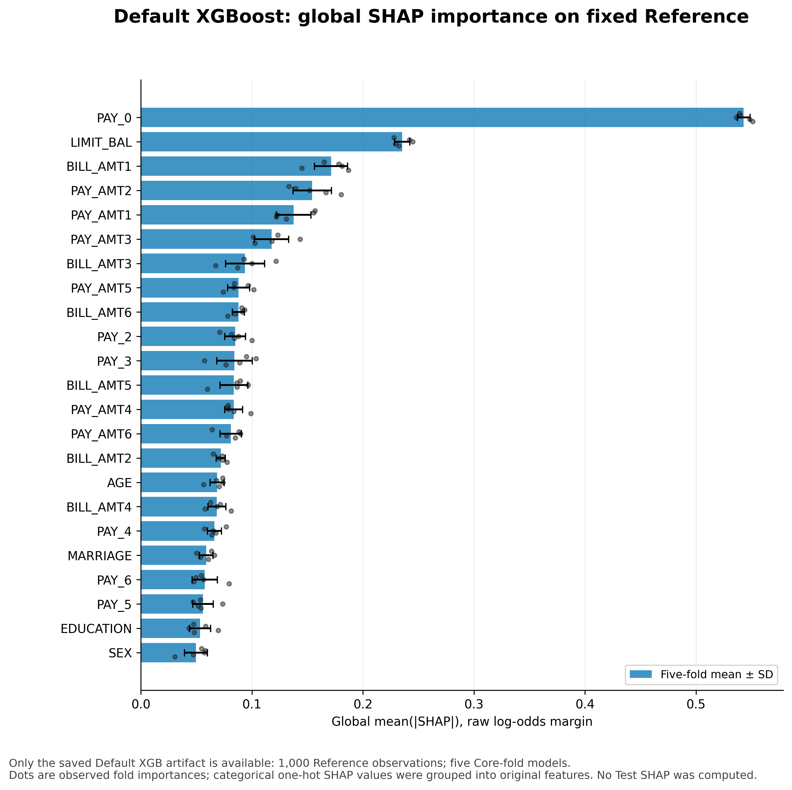
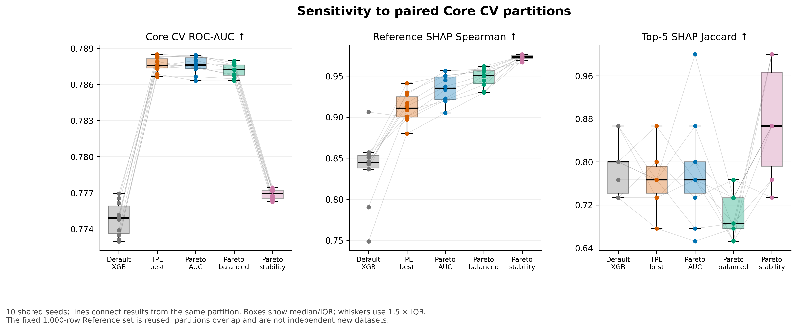
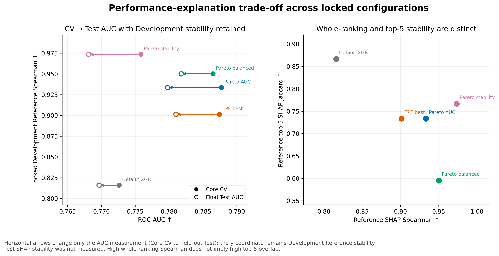

# Chương 3. Thực nghiệm và đánh giá

**Đề tài:** Tối ưu đa mục tiêu siêu tham số XGBoost cho dự đoán rủi ro tín dụng cá nhân xét đến hiệu năng dự đoán và độ ổn định của giải thích SHAP.

**Tác giả:** Lê Hoàng Sơn, Phạm Thiên Phúc — **GVHD:** TS. Phan Tấn Quốc.

Chương này trình bày kết quả đã lưu của thực nghiệm, tuân theo 15 mục trong [đề cương](LeHoangSon_PhamThienPhuc_Decuong_DACN.docx). Các bảng số liệu lấy từ `artifacts/tables/`; những phép phân tích bổ sung chỉ đọc kết quả hiện có. Quy ước dấu phẩy là dấu thập phân; các chênh lệch là chênh lệch tuyệt đối của chỉ số. Số sau dấu ± là độ lệch chuẩn mô tả với `ddof=0`, không phải sai số chuẩn hoặc khoảng tin cậy. Tập Final Test đã được đánh giá theo giao thức khóa; việc hoàn thiện chương và sinh hình không huấn luyện hay chấm Test thêm lần nữa.

## 3.1. Dữ liệu thực nghiệm

Bộ dữ liệu **Default of Credit Card Clients** của UCI gồm 30.000 khách hàng tại Đài Loan, với thông tin nhân khẩu học và lịch sử thanh toán, hóa đơn, số tiền trả trong sáu tháng từ tháng 4 đến tháng 9 năm 2005. UCI xác định 23 biến giải thích và nhãn default nhị phân. [Nguồn dữ liệu UCI](https://archive.ics.uci.edu/dataset/350/default%2Bof%2Bcredit%2Bcard%2Bclients).

Tệp [dữ liệu gốc](../data/raw/default_credit_card.csv) có **25 cột**: `ID`, 23 biến dự đoán và `default.payment.next.month`. Sau loại `ID`, còn **24 biến gồm 23 đầu vào và một nhãn**, không phải 24 biến dự đoán. Trong 30.000 quan sát có 6.636 trường hợp default và 23.364 trường hợp không default; tỷ lệ lớp dương là **22,12%**. Kiểm tra tệp hiện có không ghi nhận ô thiếu. Mã phân loại ít gặp hoặc ngoài danh mục chuẩn vẫn cần xử lý như trình bày ở mục 3.2.

| Nhóm đầu vào | Các biến | Số biến |
|---|---|---:|
| Nhân khẩu học phân loại | `SEX`, `EDUCATION`, `MARRIAGE` | 3 |
| Hạn mức và tuổi | `LIMIT_BAL`, `AGE` | 2 |
| Trạng thái thanh toán | `PAY_0`, `PAY_2`, …, `PAY_6` | 6 |
| Số tiền hóa đơn | `BILL_AMT1`, …, `BILL_AMT6` | 6 |
| Số tiền đã trả | `PAY_AMT1`, …, `PAY_AMT6` | 6 |

Phép chia phân tầng 80/20 giữ lại **24.000 mẫu Development** và **6.000 mẫu Final Test**. Development tiếp tục được chia thành **Core 23.000 mẫu** và **SHAP Reference 1.000 mẫu**. Ba tập Core, Reference và Test không giao nhau. Test có 1.327 trường hợp default và 4.673 trường hợp không default, tương ứng **22,1167%**. Tỷ lệ này là thống kê của tập đã khóa, không được sử dụng để điều chỉnh mô hình.

Nhãn default của bộ dữ liệu phản ánh bài toán dự đoán thanh toán thẻ trong tháng kế tiếp. Kết quả không trực tiếp đại diện cho mọi loại nợ xấu, sản phẩm cho vay hoặc khách hàng ngân hàng Việt Nam. Cấu hình nhóm biến và phép chia được lưu trong [configs/data.yaml](../configs/data.yaml).

## 3.2. Tiền xử lý dữ liệu

Pipeline trong [preprocessing.py](../src/creditrisk/preprocessing.py) gộp `EDUCATION` nhận giá trị 0, 5, 6 vào nhóm 4 và `MARRIAGE=0` vào nhóm 3. Đây là quy tắc ánh xạ cố định; không sử dụng nhãn hoặc thống kê Test. Ba biến phân loại được one-hot bằng `OneHotEncoder(handle_unknown="ignore", drop=None)`.

Logistic Regression sử dụng `StandardScaler` cho `LIMIT_BAL`, `AGE`, các biến hóa đơn và số tiền đã trả. Các mô hình cây giữ nguyên thang đo của nhóm số này. Sáu biến trạng thái thanh toán được giữ ở dạng số thứ tự. Vì vậy, không có bước chuẩn hóa số học chung cho mọi mô hình. Không có bước cân bằng lớp bằng lấy mẫu lại trong các cấu hình thực nghiệm hiện tại.

Với mỗi fold, encoder và scaler được **fit chỉ trên train Core**, rồi transform validation Core và cùng tập Reference. Một pipeline mới được tạo cho mỗi fold; không fit các biến đổi có tham số trên toàn bộ dữ liệu trước CV. Trong lần huấn luyện cuối, pipeline được fit trên 24.000 mẫu Development rồi transform Test. Việc đưa Reference trở lại Development trong lần fit cuối diễn ra sau khi khóa cấu hình, khi không còn dùng mô hình này để đo stability của HPO.

Để so sánh độ quan trọng trên cùng 23 biến ban đầu, các đóng góp SHAP của những cột one-hot thuộc biến $j$ được cộng **có dấu theo từng quan sát trước khi lấy trị tuyệt đối**:

$$
\phi_{ij}^{\mathrm{group}}=\sum_{\ell\in G_j}\phi_{i\ell}^{\mathrm{encoded}},
\qquad I_j=\frac{1}{N_{ref}}\sum_{i=1}^{N_{ref}}
\left|\phi_{ij}^{\mathrm{group}}\right|.
$$

Phép tính này khác với cộng các trị tuyệt đối từng cột one-hot: các đóng góp trái dấu có thể triệt tiêu ở bước nhóm. [shap_utils.py](../src/creditrisk/shap_utils.py) kiểm tra tên biến, số chiều và tính cộng của SHAP trước khi dùng các vector độ quan trọng cho stability.

## 3.3. Môi trường thực nghiệm: phần cứng, phần mềm và phiên bản thư viện

Hai manifest HPO chính ghi **Python 3.10.21**, nền tảng `Linux-7.2.7-200.fc44.x86_64-x86_64-with-glibc2.41` và **12 CPU logic**. Đây là thông tin được ghi khi chạy thực nghiệm, không phải suy đoán từ phiên máy hiện tại. Manifest không lưu model CPU, dung lượng RAM hay thông tin GPU; những mục này được ghi nhận là **chưa có dấu vết lịch sử**, không tự điền bằng một cấu hình giả định.

| Thành phần | Phiên bản ghi trong manifest thực nghiệm |
|---|---:|
| XGBoost | 3.2.0 |
| Optuna | 5.0.0 |
| scikit-learn | 1.7.2 |
| NumPy | 1.26.4 |
| pandas | 2.3.3 |
| SciPy | 1.15.3 |
| PyYAML | 6.0.3 |

Nguồn truy xuất là [manifest TPE](../artifacts/tables/xgb_single_hpo_manifest.csv), [manifest NSGA-II](../artifacts/tables/xgb_multi_hpo_manifest.csv) và [manifest Final Test](../artifacts/tables/xgb_final_test_manifest.json). Môi trường kiểm tra hiện tại còn có SHAP 0.49.1, LightGBM 4.7.0 và CatBoost 1.2.10; các phiên bản này không được manifest lịch sử ghi lại, nên không được coi là bằng chứng về phiên bản của lần benchmark ban đầu.

Cấu hình HPO dùng `objective="binary:logistic"`, `tree_method="hist"`, `eval_metric="logloss"`, `random_state=42`, `n_jobs=-1`; không có thiết lập CUDA trong cấu hình. TreeSHAP được tính bằng API native `Booster.predict(pred_contribs=True, approx_contribs=False)`. Do đó, việc cài thư viện `shap` không có nghĩa toàn bộ số liệu stability được tính qua `shap.TreeExplainer`.

Thời gian trong các bảng được giữ theo định nghĩa từng script. `duration_sec` của baseline bao gồm tiền xử lý, huấn luyện và đánh giá đủ năm fold; `duration_seconds` HPO còn bao gồm TreeSHAP. Các giá trị này mô tả chi phí của lượt chạy được ghi lại, không phải so sánh tốc độ phần cứng có kiểm soát.

## 3.4. Thiết kế và quy trình thực nghiệm

Bài toán tối ưu xét đồng thời hai mục tiêu cần cực đại:

$$
\max_{\theta\in\Theta} F(\theta)
=\left[f_1(\theta),f_2(\theta)\right]
=\left[\overline{\mathrm{ROC\!\!-\!\!AUC}}_{Core\ CV}(\theta),S(\theta)\right].
$$

Đầu tiên, sáu baseline được đánh giá trên cùng các fold Core. Sau đó XGBoost được tối ưu theo hai nhánh có cùng không gian tìm kiếm và ngân sách 64 trial: TPE chỉ tối đa ROC-AUC; NSGA-II tối đa cả ROC-AUC và Spearman SHAP. TPE vẫn được đo SHAP để đối chiếu, nhưng stability không tham gia lựa chọn trial tốt nhất của nhánh này.

Phép kiểm toán Pareto và quy tắc chọn nghiệm chỉ đọc hai objective Development. Kiểm tra độ nhạy dùng lại năm cấu hình đã khóa; không chọn lại trial, siêu tham số hay vai trò nghiệm theo kết quả mới. Đánh giá cuối là năm lần fit và năm lần chấm trong **một lượt đánh giá đã khóa**. Một mô hình refit duy nhất không cung cấp độ ổn định giữa các lần huấn luyện; vì vậy không có mục tiêu stability trên Test trong kết quả hiện có.

Ba notebook thực hành tiếp nối notebook phân chia dữ liệu: [04 — benchmark](../notebooks/04_baseline_benchmarking.ipynb), [05 — HPO và Pareto](../notebooks/05_xgb_hpo_and_pareto_analysis.ipynb), [06 — độ nhạy và đánh giá cuối](../notebooks/06_sensitivity_and_final_evaluation.ipynb). Chúng đọc kết quả đã lưu và trình bày phân tích, không kích hoạt lại HPO hay đánh giá Test.

## 3.5. Số lần chạy, seed, fold và protocol đánh giá

| Thành phần | Thiết lập đã khóa |
|---|---|
| Outer split | Stratified 80/20, seed 42 |
| Reference | 1.000 quan sát từ Development, seed 42; loại khỏi Core |
| Core CV chính | 5 fold phân tầng; mỗi fold train 18.400, validation 4.600 mẫu |
| Seed mô hình XGBoost | 42 ở mọi fold/trial và kiểm tra độ nhạy |
| TPE chính | 64 trial hoàn thành, seed sampler 42, 16 startup trial |
| NSGA-II chính | 64 trial hoàn thành, seed sampler 42, quần thể 16 |
| Ngân sách hai nhánh chính | 320 lần fit và 320 lần tính SHAP mỗi nhánh; không có trial lỗi |
| Kiểm tra độ nhạy | Seed phân hoạch 101–110; 5 cấu hình × 10 seed × 5 fold = 250 lần fit/SHAP |
| Final Test | 5 cấu hình, mỗi cấu hình fit một lần trên 24.000 Development; ngưỡng 0,5 |

Pilot có tám trial mỗi nhánh và được lưu riêng; các kết quả chính trong chương sử dụng hai study 64 trial, không gộp pilot để tăng kích thước mẫu. Mã trial là mã đánh số từ 0 trong từng study: trial 50 của TPE và trial 50 của NSGA-II là hai cấu hình khác nhau.

Không gian tìm kiếm gồm đúng chín siêu tham số theo [xgb_search_space.yaml](../configs/xgb_search_space.yaml):

| Siêu tham số | Khoảng/kiểu lấy mẫu |
|---|---|
| `n_estimators` | 100–1.000, số nguyên bước 50 |
| `max_depth` | 2–10, số nguyên bước 1 |
| `learning_rate` | 0,01–0,30, thang log |
| `min_child_weight` | 1–15, số nguyên bước 1 |
| `subsample` | 0,50–1,00, bước 0,05 |
| `colsample_bytree` | 0,50–1,00, bước 0,05 |
| `gamma` | 0–10, bước 0,5 |
| `reg_alpha` | $10^{-4}$–10, thang log |
| `reg_lambda` | $10^{-3}$–100, thang log |

Mọi trial sử dụng cùng dữ liệu, Reference và phân hoạch CV chính. HPO manifest lưu fingerprint giao thức; sensitivity và Final Test manifest lưu nguồn cấu hình, checksum đầu vào và số lần đánh giá. Các bước kiểm tra sau thực nghiệm có thể xác minh artifact mà không tạo thêm mô hình. Việc dùng CV để tìm trial tốt nhất đồng thời làm phát sinh thiên lệch lựa chọn trên Development; đây là lý do phải giữ Test ngoài quá trình tìm kiếm.

## 3.6. Các chỉ số đánh giá

Gọi $y_i\in\{0,1\}$, $p_i=P(y_i=1\mid x_i)$, và $\hat y_i=\mathbf 1[p_i\ge0,5]$. TP, FP, TN, FN lần lượt là đúng dương, dương giả, đúng âm, âm giả. ROC-AUC đánh giá khả năng xếp hạng một mẫu dương cao hơn một mẫu âm; điểm bằng nhau nhận trọng số $1/2$:

$$
\mathrm{AUC}=\frac{1}{n_+n_-}\sum_{i:y_i=1}\sum_{j:y_j=0}
\left(\mathbf 1[p_i>p_j]+\tfrac12\mathbf 1[p_i=p_j]\right),
\quad f_1(\theta)=\frac15\sum_{r=1}^{5}\mathrm{AUC}_r(\theta).
$$

Average Precision dùng $\mathrm{AP}=\sum_k(R_k-R_{k-1})P_k$, trong đó $P_k,R_k$ là precision và recall tại các mức điểm. AP được tính bằng `average_precision_score`, **không đồng nhất với tích phân hình thang của đường PR**. Giá trị AP nên được đọc cùng tỷ lệ lớp dương 22,12%; ROC-AUC và AP không phụ thuộc vào riêng ngưỡng 0,5.

$$
\mathrm{Precision}=\frac{TP}{TP+FP},\qquad
\mathrm{Recall}=\frac{TP}{TP+FN},\qquad
F_1=\frac{2TP}{2TP+FP+FN},
$$

$$
\mathrm{Balanced\ Accuracy}=\frac12\left(\frac{TP}{TP+FN}+\frac{TN}{TN+FP}\right),
\qquad \mathrm{Brier}=\frac1n\sum_{i=1}^{n}(p_i-y_i)^2.
$$

AUC, AP, precision, recall, F1 và balanced accuracy càng cao càng tốt; Brier càng thấp càng tốt. Brier phản ánh sai số xác suất tổng hợp, không tự chứng minh xác suất đã được hiệu chuẩn. Khi precision/recall/F1 có mẫu số bằng 0, mã nguồn dùng `zero_division=0`.

Với mô hình fold $r$, global importance của biến $j$ là trung bình trị tuyệt đối của SHAP đã nhóm trên cùng 1.000 mẫu Reference:

$$
I_j^{(r)}=\frac1{1000}\sum_{i=1}^{1000}|\phi_{ij}^{(r)}|,
\quad \rho_s(I^{(a)},I^{(b)})=
\mathrm{Corr}\!\left(\mathrm{rank}(I^{(a)}),\mathrm{rank}(I^{(b)})\right),
$$

$$
S(\theta)=\frac{2}{R(R-1)}\sum_{a<b}\rho_s(I^{(a)},I^{(b)}),\qquad R=5.
$$

Có $\binom52=10$ cặp vector giữa năm fold. SciPy gán thứ hạng trung bình khi có ties. Độ tương quan của vector hằng không xác định; implementation quy ước cặp chứa vector hằng nhận 0. Miền của Spearman là $[-1,1]$; càng gần 1 thì thứ hạng toàn bộ 23 biến càng nhất quán.

Với $A_r$ là tập năm biến có importance cao nhất ở fold $r$, chỉ số bổ sung là:

$$
J_5(\theta)=\frac{2}{R(R-1)}\sum_{a<b}\frac{|A_a\cap A_b|}{|A_a\cup A_b|}.
$$

Ties ở ranh giới top-5 được phá bằng thứ tự biến đã cấu hình; cặp có vector hằng nhận 0. Jaccard nằm trong $[0,1]$, chỉ đánh giá thành viên top-5, còn Spearman đánh giá thứ hạng toàn bộ biến. Hai chỉ số đo hai khía cạnh khác nhau và có thể biến thiên trái chiều. Đơn vị tổng hợp độ nhạy là **một phân hoạch năm fold**, không phải 50 fold hay 100 cặp Spearman độc lập. Công thức được hiện thực trong [metrics.py](../src/creditrisk/metrics.py) và [stability.py](../src/creditrisk/stability.py).

## 3.7. Kết quả các mô hình baseline/đối chứng

**Bảng 3.1. Sáu mô hình đối chứng trên 5-fold Core CV.**

| Mô hình | ROC-AUC ± std | AP | F1 | Precision | Recall | Balanced Accuracy | Brier |
|---|---:|---:|---:|---:|---:|---:|---:|
| CatBoost | 0,784666 ± 0,006131 | 0,561650 | 0,479076 | 0,669979 | 0,373043 | 0,660450 | 0,133521 |
| Random Forest | 0,782083 ± 0,007861 | 0,559917 | 0,469098 | 0,674078 | 0,359872 | 0,655204 | 0,134151 |
| Gradient Boosting | 0,781476 ± 0,007005 | 0,551224 | 0,483310 | 0,667367 | 0,379135 | 0,662714 | 0,134605 |
| LightGBM | 0,780781 ± 0,007269 | 0,558117 | 0,482163 | 0,676199 | 0,374809 | 0,661919 | 0,134069 |
| XGBoost mặc định | 0,772620 ± 0,007096 | 0,546795 | 0,478584 | 0,661302 | 0,375202 | 0,660301 | 0,136651 |
| Logistic Regression | 0,726933 ± 0,004152 | 0,506727 | 0,366932 | 0,709027 | 0,247645 | 0,609391 | 0,144338 |

Nguồn: [baseline_benchmark.csv](../artifacts/tables/baseline_benchmark.csv). Các cột phụ trình bày trung bình năm fold; std đầy đủ của từng chỉ số nằm trong tệp nguồn. “XGBoost mặc định” là tên đối chứng trong dự án, được cấu hình 200 cây, learning rate 0,1 và max depth 6; không phải toàn bộ giá trị mặc định của thư viện XGBoost 3.2.0.

CatBoost dẫn nhóm đối chứng về ROC-AUC, AP và Brier. Các mô hình cây có ROC-AUC cao hơn Logistic Regression trong thiết lập này, nhưng đây là kết luận thực nghiệm trên một tập dữ liệu và các cấu hình cụ thể. Không suy ra mọi mô hình cây luôn tốt hơn mọi mô hình tuyến tính. Khác biệt ROC-AUC giữa CatBoost và Random Forest chỉ khoảng 0,002583; thanh std không thay thế kiểm định ghép cặp và cũng không chứng minh thứ tự tổng quát ngoài bộ dữ liệu.

Logistic Regression có precision 0,709027 cao nhất bảng nhưng recall 0,247645 thấp nhất, minh họa việc ưu thế ở một chỉ số phụ thuộc ngưỡng không đồng nghĩa ưu thế về xếp hạng. Gradient Boosting có F1 0,483310 cao nhất nhóm baseline. Do đó phải phân biệt “dẫn đầu AUC” với “dẫn đầu mọi metric”.

Thời gian đủ năm fold được ghi là LR 2,934 giây, RF 3,984 giây, XGBoost 4,787 giây, CatBoost 4,937 giây, LightGBM 6,182 giây và GBM 52,370 giây. Đây là thời gian pipeline của một lượt chạy, không phải thời gian fit trung bình hoặc đánh giá độ trễ triển khai. Các artifact baseline chỉ lưu chỉ số tổng hợp; không có xác suất theo quan sát để dựng lại ROC/PR của từng fold. Vì vậy chương dùng biểu đồ metric thật và không nội suy đường cong từ một giá trị AUC/AP.

**Trả lời RQ4 ở mức benchmark:** XGBoost đối chứng đứng thứ năm trong sáu cấu hình về ROC-AUC. Sau HPO, các nghiệm XGBoost ưu tiên AUC và cân bằng vượt ROC-AUC trung bình của cả năm thuật toán đối chứng còn lại trên Core CV; phạm vi kết luận này được định lượng tiếp ở mục 3.11.

## 3.8. Kết quả XGBoost tối ưu đơn mục tiêu

TPE dùng phân bố tham số của các trial tốt và còn lại để đề xuất trial tiếp theo; thuật toán sampler của nhánh này chỉ quan sát mục tiêu ROC-AUC để lựa chọn. [Tài liệu TPESampler của Optuna](https://optuna.readthedocs.io/en/stable/reference/samplers/generated/optuna.samplers.TPESampler.html).

Study chính hoàn thành 64 trial, mỗi trial dùng năm mô hình Core CV và cùng Reference. Trial **50** là nghiệm có ROC-AUC cao nhất **trong nhánh TPE**, bằng 0,787436; đây không phải AUC cao nhất của toàn bộ hai nhánh HPO. Các trial TPE có AUC từ 0,757544 đến 0,787436 và Spearman từ 0,804249 đến 0,957115.

**Bảng 3.2. Đối chứng XGBoost và nghiệm TPE tốt nhất trên Development.**

| Cấu hình | Trial | ROC-AUC CV | Spearman SHAP | Jaccard top-5 |
|---|---:|---:|---:|---:|
| XGBoost mặc định | — | 0,772620 | 0,816008 | 0,866667 |
| TPE tối ưu ROC-AUC | 50 | 0,787436 | 0,901482 | 0,733333 |
| TPE trừ đối chứng | — | +0,014815 | +0,085474 | −0,133333 |

Nguồn: [xgb_default_objectives.csv](../artifacts/tables/xgb_default_objectives.csv) và [xgb_single_hpo_best.csv](../artifacts/tables/xgb_single_hpo_best.csv). Chênh lệch được tính trước khi làm tròn, nên phép trừ các số đã làm tròn có thể khác chữ số cuối.

Trial 50 có 550 cây, độ sâu tối đa 8, learning rate 0,013356, min child weight 4, subsample 0,55, colsample 0,60, gamma 3,5, L1 0,003035 và L2 6,150117. Cấu hình này cải thiện AUC và Spearman so với đối chứng, đồng thời làm giảm Jaccard top-5. Không thể quy phần giảm Jaccard cho một siêu tham số riêng vì chín tham số cùng thay đổi.

**Trả lời RQ2:** nghiệm tối ưu AUC của TPE có Spearman tương đối cao và tốt hơn đối chứng, nhưng **không đồng thời tối ưu mọi khía cạnh ổn định**. Spearman 0,901482 không phải cao nhất trong các trial đã khảo sát; Jaccard 0,733333 thấp hơn đối chứng 0,866667. Tối đa AUC không bảo đảm tập năm biến quan trọng nhất ổn định hơn.

## 3.9. Kết quả XGBoost tối ưu đa mục tiêu

Nhánh NSGA-II hoàn thành 64 trial với hai hướng `maximize`. Sampler sử dụng chọn lọc nghiệm không bị chi phối và duy trì quần thể để tìm các phương án đánh đổi; đây là cách triển khai thuật toán đa mục tiêu trong Optuna. [Tài liệu NSGAIISampler](https://optuna.readthedocs.io/en/stable/reference/samplers/generated/optuna.samplers.NSGAIISampler.html).

Trong [xgb_multi_hpo_trials.csv](../artifacts/tables/xgb_multi_hpo_trials.csv), ROC-AUC nằm trong khoảng **0,757544–0,787721**, Spearman trong khoảng **0,799802–0,973594**. Biên nghiệm quan sát không tạo thành một cấu hình đạt cực đại cả hai mục tiêu. Trial 44 có AUC lớn nhất, còn trial 57 có Spearman lớn nhất. Ngân sách 64 trial xác định tập nghiệm đã tìm thấy, không bảo đảm tìm ra Pareto front toàn cục của không gian tham số.

Để trả lời RQ1 cho đủ chín tham số, bảng dưới tính tương quan Spearman giữa giá trị tham số và từng objective, **riêng trong mỗi study 64 trial**, từ các CSV đã lưu. Đây là tương quan giữa siêu tham số với chỉ số, khác với Spearman giữa các vector importance dùng làm objective stability.

| Siêu tham số | TPE: ρ với AUC | TPE: ρ với S | NSGA-II: ρ với AUC | NSGA-II: ρ với S |
|---|---:|---:|---:|---:|
| `max_depth` | +0,204 | −0,000 | +0,172 | +0,106 |
| `learning_rate` | −0,470 | −0,446 | −0,056 | −0,555 |
| `n_estimators` | +0,236 | −0,001 | +0,078 | −0,056 |
| `subsample` | −0,486 | −0,038 | +0,047 | +0,134 |
| `colsample_bytree` | −0,180 | −0,478 | −0,302 | −0,205 |
| `min_child_weight` | −0,365 | −0,132 | +0,002 | +0,112 |
| `gamma` | −0,012 | +0,423 | −0,143 | +0,347 |
| `reg_alpha` | −0,255 | +0,038 | −0,282 | +0,134 |
| `reg_lambda` | +0,349 | +0,426 | +0,117 | +0,379 |

Learning rate có liên hệ âm với stability ở cả hai study; gamma và L2 có liên hệ dương; colsample có liên hệ âm trong các trial quan sát. Độ sâu, số cây, subsample và min child weight thể hiện liên hệ khác nhau giữa hai sampler. Điều đó cho thấy kết quả phụ thuộc vùng tìm kiếm và các cấu hình tham số đồng xuất hiện, không hỗ trợ quy tắc đơn điệu áp dụng cho mọi XGBoost.

Notebook 05 bổ sung mô hình thay thế và permutation importance trên bảng trial để khảo sát khả năng giải thích biến thiên objective của siêu tham số. Importance này là của **mô hình thay thế lịch sử HPO**, không phải SHAP importance của 23 biến tín dụng và không phải hiệu ứng can thiệp một tham số. Notebook kiểm tra khả năng dự đoán objective trên các nhóm trial giữ lại; nếu R² kiểm tra âm, thứ tự importance của mô hình thay thế không đủ tin cậy để kết luận tham số nào ảnh hưởng nhất. Trial được đề xuất thích nghi, nhiều tham số tương quan, ngân sách nhỏ và cấu hình có thể lặp lại. Vì vậy bảng tương quan không kèm p-value nhân quả; các phân tích importance chỉ mang tính khám phá.

**Trả lời RQ1 từ dữ liệu:** chín siêu tham số tạo ra các cấu hình có hai objective khác nhau, và mức liên hệ với AUC khác mức liên hệ với stability. Dấu và độ lớn nêu trên mô tả lịch sử tìm kiếm này; muốn tách ảnh hưởng riêng từng tham số phải thực hiện ablation hoặc thiết kế can thiệp có kiểm soát trên Development trong một nghiên cứu tiếp theo.

## 3.10. Phân tích Pareto front

Một nghiệm $a$ chi phối nghiệm $b$ khi:

$$
f_1(a)\ge f_1(b),\quad f_2(a)\ge f_2(b),
\quad \text{và ít nhất một bất đẳng thức là nghiêm ngặt}.
$$

Kiểm toán độc lập trong [pareto.py](../src/creditrisk/pareto.py) tìm được **sáu nghiệm không bị chi phối với sáu cặp objective khác nhau**, khớp kết quả Optuna. Bảng đầy đủ nằm trong [xgb_pareto_audit.csv](../artifacts/tables/xgb_pareto_audit.csv); [xgb_pareto_checks.csv](../artifacts/tables/xgb_pareto_checks.csv) lưu các điều kiện kiểm tra. Pareto front này được xác định trong nhánh NSGA-II chính, không phải tất cả cấu hình XGBoost có thể có.

| Trial | ROC-AUC CV | Spearman SHAP | Jaccard top-5 | Khoảng cách chuẩn hóa tới (1,1) | Vai trò |
|---|---:|---:|---:|---:|---|
| 22 | 0,785528 | 0,950296 | 0,628571 | 0,609681 | Không chọn |
| 44 | 0,787721 | 0,933498 | 0,733333 | 1,000000 | Ưu tiên AUC |
| 53 | 0,780534 | 0,969664 | 0,766667 | 0,612952 | Không chọn |
| 56 | 0,787270 | 0,941403 | 0,595238 | 0,803744 | Không chọn |
| 57 | 0,775843 | 0,973594 | 0,766667 | 1,000000 | Ưu tiên ổn định |
| 61 | 0,786497 | 0,950198 | 0,595238 | 0,592539 | Cân bằng |

Quy tắc chọn ưu tiên AUC lấy trial 44; ưu tiên stability lấy trial 57. Với mục tiêu $q\in\{1,2\}$, chuẩn hóa min–max **trên tập các điểm Pareto**:

$$
\widetilde f_q(\theta)=\frac{f_q(\theta)-\min_{P} f_q}{\max_{P} f_q-\min_{P} f_q},
\qquad d(\theta)=\sqrt{(1-\widetilde f_1)^2+(1-\widetilde f_2)^2}.
$$

Sau khi loại hai nghiệm cực trị đã chọn, nghiệm còn lại có $d$ nhỏ nhất là trial 61, với $\widetilde f_1=0,896970$, $\widetilde f_2=0,416487$ và $d=0,592539$. Điểm $(1,1)$ ở đây là **điểm lý tưởng trong không gian đã chuẩn hóa**. Không chọn bằng khoảng cách thô tới AUC=1 và Spearman=1. Nếu một chiều có biên độ bằng 0, implementation gán giá trị chuẩn hóa của chiều đó là 1. Các quy tắc phá hòa ưu tiên objective còn lại và mã trial nhỏ hơn; không dùng Test.

**Bảng 3.3. Các nghiệm đại diện và đối chứng trên Development.**

| Nguồn | Vai trò | Trial | ROC-AUC CV | Spearman | Jaccard top-5 | Δ AUC so với TPE | Δ Spearman so với TPE |
|---|---|---:|---:|---:|---:|---:|---:|
| XGBoost đối chứng | Mặc định của dự án | — | 0,772620 | 0,816008 | 0,866667 | −0,014815 | −0,085474 |
| TPE | Tối ưu AUC | 50 | 0,787436 | 0,901482 | 0,733333 | 0,000000 | 0,000000 |
| NSGA-II | Ưu tiên AUC | 44 | 0,787721 | 0,933498 | 0,733333 | +0,000286 | +0,032016 |
| NSGA-II | Ưu tiên ổn định | 57 | 0,775843 | 0,973594 | 0,766667 | −0,011593 | +0,072112 |
| NSGA-II | Cân bằng | 61 | 0,786497 | 0,950198 | 0,595238 | −0,000938 | +0,048715 |

Nguồn: [xgb_pareto_selected.csv](../artifacts/tables/xgb_pareto_selected.csv) và [xgb_pareto_comparison.csv](../artifacts/tables/xgb_pareto_comparison.csv). Trial 44 chi phối nghiệm TPE theo hai objective trong CV chính. Trial 61 tăng Spearman nhưng giảm AUC và Jaccard so với TPE, nên là một lựa chọn đánh đổi. Jaccard không phải objective của Pareto front này.

| Siêu tham số | TPE 50 | Pareto AUC 44 | Pareto stability 57 | Pareto balanced 61 |
|---|---:|---:|---:|---:|
| `max_depth` | 8 | 9 | 4 | 9 |
| `learning_rate` | 0,013356 | 0,010239 | 0,010239 | 0,010239 |
| `n_estimators` | 550 | 550 | 100 | 550 |
| `subsample` | 0,55 | 0,75 | 0,90 | 0,90 |
| `colsample_bytree` | 0,60 | 0,50 | 0,50 | 0,50 |
| `min_child_weight` | 4 | 10 | 13 | 11 |
| `gamma` | 3,5 | 1,0 | 3,5 | 3,5 |
| `reg_alpha` | 0,003035 | 0,000380 | 0,004876 | 0,000380 |
| `reg_lambda` | 6,150117 | 20,678409 | 20,678409 | 20,678409 |

Trong các nghiệm này, ưu tiên stability dùng ít cây và cây nông hơn, còn balanced vẫn cho phép độ sâu 9 nhưng đi cùng L2 và min child weight lớn hơn TPE. Độ sâu tối đa là một ràng buộc cho phép, không khẳng định mọi cây đạt độ sâu đó. Kết quả không hỗ trợ giải thích “cây càng nông càng ổn định” như một định luật đơn biến.

## 3.11. So sánh predictive performance

Trên CV chính, trial 44 đạt ROC-AUC 0,787721, trial TPE 50 đạt 0,787436 và balanced 61 đạt 0,786497. Cả ba đều vượt CatBoost baseline 0,784666; chênh lần lượt khoảng **+0,003055**, **+0,002770** và **+0,001831**. Tuy nhiên, baseline không được HPO đầy đủ như XGBoost; so sánh này cho biết vị thế trong ngân sách và cấu hình đã dùng, không chứng minh XGBoost tối ưu luôn hơn CatBoost tối ưu.

Các cấu hình được khóa trước khi chấm Test. Mỗi cấu hình được fit một lần trên toàn bộ Development 24.000 mẫu. [Manifest Final Test](../artifacts/tables/xgb_final_test_manifest.json) ghi `status=complete`, `completed_model_fits=5`, `completed_test_evaluations=5`, `test_used_for_selection=false` và `shap_computed_on_test=false`.

**Bảng 3.4. Khả năng dự đoán trên Final Test độc lập.**

| Cấu hình | AUC CV chính | Spearman Development qua 10 phân hoạch | ROC-AUC Test | AP Test | Brier Test |
|---|---:|---:|---:|---:|---:|
| Pareto ưu tiên AUC | 0,787721 | 0,933913 | 0,779784 | 0,557473 | 0,134759 |
| Pareto ưu tiên ổn định | 0,775843 | 0,972586 | 0,768113 | 0,537826 | 0,144236 |
| Pareto cân bằng | 0,786497 | 0,947777 | 0,781791 | 0,559020 | 0,134622 |
| TPE tối ưu AUC | 0,787436 | 0,911472 | 0,781011 | 0,558185 | 0,134681 |
| XGBoost đối chứng | 0,772620 | 0,837589 | 0,769664 | 0,539973 | 0,137585 |

Nguồn: [xgb_final_test_summary.csv](../artifacts/tables/xgb_final_test_summary.csv) và [xgb_sensitivity_summary.csv](../artifacts/tables/xgb_sensitivity_summary.csv). Cột stability là số đo trên **Development**, không phải trên Test. Bảng 3.5 về độ nhạy được trình bày ở mục 3.12.

Balanced đạt AUC, AP cao nhất và Brier thấp nhất **trong năm cấu hình đã khóa**. So với TPE, chênh lần lượt **+0,000780 AUC**, **+0,000835 AP**, **−0,000060 Brier**. Các chênh nhỏ được diễn giải mô tả; dữ liệu tổng hợp hiện có không đủ để tính khoảng tin cậy ghép cặp hoặc kiểm định khác biệt AUC Test. Thứ tự trial 44 và trial 61 thay đổi từ CV sang Test, nên không thể lấy nghiệm dẫn đầu CV làm bằng chứng chắc chắn về nghiệm dẫn đầu dữ liệu mới.

**Các chỉ số tại ngưỡng 0,5 trên Final Test.**

| Cấu hình | Precision | Recall | F1 | Balanced Accuracy | TN / FP / FN / TP |
|---|---:|---:|---:|---:|---:|
| Pareto ưu tiên AUC | 0,665260 | 0,356443 | 0,464181 | 0,652756 | 4435 / 238 / 854 / 473 |
| Pareto ưu tiên ổn định | 0,750000 | 0,149209 | 0,248900 | 0,567543 | 4607 / 66 / 1129 / 198 |
| Pareto cân bằng | 0,664773 | 0,352675 | 0,460857 | 0,651086 | 4437 / 236 / 859 / 468 |
| TPE tối ưu AUC | 0,667586 | 0,364732 | 0,471735 | 0,656580 | 4432 / 241 / 843 / 484 |
| XGBoost đối chứng | 0,663087 | 0,372268 | 0,476834 | 0,659278 | 4422 / 251 / 833 / 494 |

XGBoost đối chứng có F1 và balanced accuracy cao nhất ở ngưỡng 0,5, mặc dù AUC thấp hơn TPE và balanced. Nghiệm ưu tiên stability chỉ phát hiện **198/1.327** default, bỏ sót **1.129** và tạo **66** dương giả; TPE phát hiện **484**, bỏ sót **843** và tạo **241** dương giả. Đây là khác biệt trực tiếp từ ma trận nhầm lẫn, không phải bằng chứng một cấu hình tối ưu hơn về chi phí ngân hàng.

Không có xác suất từng quan sát được bảo tồn trong thư mục predictions hiện tại. Một bảng AUC/AP và ma trận nhầm lẫn không xác định duy nhất đường ROC hoặc PR. Hình 3.4 vì vậy trình bày **metric và ma trận thật**, có ghi rõ thiếu ROC/PR; không dựng đường cong giả hay chấm lại Test để điền khoảng trống. Năm thuật toán baseline ngoài đối chứng XGBoost chưa được chấm trong lượt Final Test này; RQ4 về các thuật toán đó chỉ được trả lời ở mức Core CV.

## 3.12. Phân tích SHAP stability

TreeSHAP native được tính trên **raw margin log-odds**, loại cột bias khỏi vector importance, và kiểm tra tổng các đóng góp cộng bias bằng margin. Các kỳ vọng dùng thông tin đường đi của cây; Reference là tập **quan sát cần được giải thích**, không phải một background interventional riêng. Cách xác định kỳ vọng khác nhau tạo ra cách phân bổ đóng góp khác nhau khi các biến phụ thuộc nhau. [Tài liệu TreeExplainer về tree-path-dependent và interventional](https://shap.readthedocs.io/en/stable/generated/shap.TreeExplainer.html).

Tệp [xgb_default_importance_by_fold.csv](../artifacts/shap/xgb_default_importance_by_fold.csv) lưu năm vector global importance thật của **XGBoost đối chứng** trên 1.000 Reference, với 23 biến ban đầu. Tệp này cho phép kiểm tra biến thiên theo fold nhưng không có SHAP theo từng quan sát để dựng beeswarm. Các vector chi tiết của trial TPE và Pareto không được bảo tồn trong artifact hiện tại; do đó không thể khẳng định top-10 cụ thể của từng nghiệm hoặc so sánh định lượng theo từng biến giữa đủ năm cấu hình.

| Biến của XGBoost đối chứng | Mean absolute SHAP ± std qua fold | Khoảng thứ hạng qua năm fold |
|---|---:|---:|
| `PAY_0` | 0,542911 ± 0,005725 | 1–1 |
| `LIMIT_BAL` | 0,235367 ± 0,006880 | 2–2 |
| `BILL_AMT1` | 0,171337 ± 0,015031 | 3–4 |
| `PAY_AMT2` | 0,154387 ± 0,017304 | 3–5 |
| `PAY_AMT1` | 0,137604 ± 0,015504 | 4–6 |
| `PAY_AMT3` | 0,117772 ± 0,015472 | 5–8 |
| `BILL_AMT3` | 0,093889 ± 0,017655 | 6–17 |
| `PAY_AMT5` | 0,088096 ± 0,009846 | 7–16 |
| `BILL_AMT6` | 0,087881 ± 0,005492 | 9–13 |
| `PAY_2` | 0,085005 ± 0,009375 | 7–15 |

`PAY_0` và `LIMIT_BAL` lần lượt giữ hạng 1 và 2 ở cả năm fold; `BILL_AMT1` đứng hạng 3–4. Các biến thấp hơn có thể đổi thứ hạng đáng kể, như `BILL_AMT3` từ 6 đến 17. Trung bình trị tuyệt đối cho biết độ lớn đóng góp của mô hình, không cho biết chiều tăng/giảm default, cũng không cho phép kết luận nhân quả về hành vi thanh toán.

Sau khi khóa năm cấu hình, kiểm tra độ nhạy thay đổi seed phân hoạch Core từ 101 đến 110, giữ nguyên Reference và seed mô hình 42.

**Bảng 3.5. Stability và AUC qua 10 phân hoạch Core mới.**

| Cấu hình | ROC-AUC CV ± std | Spearman SHAP ± std | Jaccard top-5 ± std |
|---|---:|---:|---:|
| Pareto ưu tiên AUC | 0,787594 ± 0,000682 | 0,933913 ± 0,015876 | 0,782857 ± 0,092954 |
| Pareto cân bằng | 0,787178 ± 0,000542 | 0,947777 ± 0,010718 | 0,699524 ± 0,037219 |
| Pareto ưu tiên ổn định | 0,776891 ± 0,000393 | 0,972586 ± 0,002856 | 0,873333 ± 0,095219 |
| TPE tối ưu AUC | 0,787643 ± 0,000585 | 0,911472 ± 0,017231 | 0,767619 ± 0,047562 |
| XGBoost đối chứng | 0,774809 ± 0,001354 | 0,837589 ± 0,039689 | 0,790000 ± 0,047258 |

Nguồn: [xgb_sensitivity_repeats.csv](../artifacts/tables/xgb_sensitivity_repeats.csv), [summary](../artifacts/tables/xgb_sensitivity_summary.csv), [paired summary](../artifacts/tables/xgb_sensitivity_paired_summary.csv). Tổng số lần fit/TreeSHAP là 250; không dùng nhãn Test.

Cả ba nghiệm Pareto có Spearman cao hơn TPE ở **10/10 phân hoạch**. Nghiệm ưu tiên stability có S trung bình 0,972586 và std 0,002856, nhỏ hơn TPE 0,017231. Tuy nhiên, balanced có Jaccard trung bình **0,699524**, thấp hơn TPE **0,767619**; chênh Jaccard âm ở bảy seed và bằng 0 ở ba seed sau khi loại sai số dấu phẩy động (làm tròn chênh lệch 12 chữ số). Vì vậy, ưu thế stability của balanced phải được hiểu theo **objective Spearman**, không phải độ ổn định top-5 hay mọi loại giải thích.

Notebook 06 thực hiện kiểm định ghép cặp hai phía từ mười dòng cùng seed: Wilcoxon signed-rank làm phân tích chính, paired t-test làm đối chiếu; hiệu chỉnh Holm riêng cho mỗi họ chín phép so sánh (ba nghiệm × AUC/Spearman/Jaccard). Chênh lệch được làm tròn 12 chữ số trước Wilcoxon để các ties toán học không bị biến thành khác biệt do dấu phẩy động. Với chênh Spearman của cả ba nghiệm so với TPE, Wilcoxon cho **p thô 0,001953** và **p Holm 0,017578**. Balanced có chênh AUC trung bình −0,000465, Wilcoxon p Holm 0,068359, trong khi paired t-test p Holm 0,029543; Jaccard balanced giảm −0,068095, Wilcoxon p Holm 0,068359. Hai phép kiểm có giả định khác nhau; không chọn phép kiểm chỉ vì cho p nhỏ hơn.

Các p-value này là **phân tích khám phá có điều kiện trên một Core và Reference cố định**. Phân hoạch dùng chung quan sát, các tập train chồng lấn, và các cấu hình đã được chọn trên chính Development; Holm không giải quyết phụ thuộc do tái sử dụng dữ liệu hay thiên lệch lựa chọn. Wilcoxon dựa trên giả định về phân bố chênh lệch và tính độc lập; paired t-test còn giả định phù hợp của phân bố chênh lệch cho suy luận t. [Tài liệu SciPy về Wilcoxon](https://docs.scipy.org/doc/scipy/reference/generated/scipy.stats.wilcoxon.html). Bằng chứng chắc chắn từ artifact là dấu và độ lớn chênh qua mười phân hoạch; p-value không chứng minh ưu thế phổ quát hoặc ưu thế trên Test.

## 3.13. Phân tích trade-off giữa performance và stability

**Trả lời RQ3:** trong ngân sách đã dùng, NSGA-II tìm được tập cấu hình cung cấp lựa chọn cân bằng hơn theo **hai objective ROC-AUC và Spearman**. Trial 44 tốt hơn TPE ở cả hai objective trong CV chính; trial 61 hy sinh 0,000938 AUC để tăng 0,048715 Spearman; trial 57 tăng 0,072112 Spearman nhưng giảm 0,011593 AUC. Đây là lợi ích của tập nghiệm nhiều phương án, không phải khẳng định sampler NSGA-II luôn thắng TPE.

**Bảng 3.6. Chênh lệch giữa các nghiệm Pareto và TPE theo từng giai đoạn.**

| Pareto trừ TPE | Δ AUC CV chính | Δ Spearman CV chính | Δ AUC qua 10 phân hoạch | Δ Spearman qua 10 phân hoạch | Δ Jaccard qua 10 phân hoạch | Δ AUC Test |
|---|---:|---:|---:|---:|---:|---:|
| Ưu tiên AUC | +0,000286 | +0,032016 | −0,000049 | +0,022441 | +0,015238 | −0,001227 |
| Ưu tiên stability | −0,011593 | +0,072112 | −0,010752 | +0,061113 | +0,105714 | −0,012898 |
| Balanced | −0,000938 | +0,048715 | −0,000465 | +0,036304 | −0,068095 | +0,000780 |

Bảng dùng chênh lệch ghép cặp theo seed ở giai đoạn độ nhạy. Nghiệm ưu tiên AUC có AUC cao hơn TPE ở 4/10 seed và thấp hơn ở 6/10, nên ưu thế CV chính không được lặp lại theo cùng chiều ở mọi phân hoạch. Balanced có AUC thấp hơn TPE ở 9/10 seed nhưng Spearman cao hơn ở cả mười. Nghiệm ưu tiên stability thể hiện đánh đổi mạnh nhất và có recall Test thấp nhất.

Một cơ sở toán học để diễn giải RQ1 là mục tiêu regularized của boosted trees:

$$
\mathcal L^{(t)}=\sum_i\ell(y_i,\widehat y_i^{(t-1)}+f_t(x_i))+\Omega(f_t),
\quad \Omega(f_t)=\gamma T+\alpha\sum_{j=1}^{T}|w_j|+\frac{\lambda}{2}\sum_{j=1}^{T}w_j^2.
$$

Ở một lá với tổng gradient $G_j$ và Hessian $H_j$, nghiệm trọng số dưới L1/L2 là
$w_j^*=-\operatorname{sgn}(G_j)\max(|G_j|-\alpha,0)/(H_j+\lambda)$. Tăng L2 giảm độ lớn trọng số; L1 có thể triệt tiêu trọng số nhỏ; gamma phạt tăng số lá. [Bài báo XGBoost của Chen và Guestrin](https://arxiv.org/abs/1603.02754).

`max_depth` và `n_estimators` điều chỉnh năng lực mô hình; learning rate co đóng góp từng vòng; min child weight đặt ngưỡng Hessian để cho phép tách; subsample và colsample điều chỉnh lấy mẫu hàng/cột. Các vai trò này được định nghĩa trong [tài liệu tham số XGBoost](https://xgboost.readthedocs.io/en/stable/parameter.html).

**Diễn giải cơ chế, chưa phải kết luận nhân quả:** khi điều kiện tách lá gần nhau, đổi tập train có thể đổi biến/điểm tách. Những biến lịch sử tín dụng liên quan nhau có thể thay thế nhau trong các cây; SHAP phân bổ đóng góp theo cấu trúc và kỳ vọng của mô hình, nên thứ hạng importance có thể đổi. Năng lực lớn hơn hoặc phạt yếu hơn có thể cho phép thêm các phân hoạch nhạy với mẫu, nhưng không bắt buộc làm stability giảm trong mọi cấu hình. Lấy mẫu hàng/cột vừa có thể giảm overfit vừa thay đổi lựa chọn biến; tương tác giữa các tham số ngăn việc dự báo dấu ảnh hưởng bằng một quy tắc đơn giản. Trial balanced có độ sâu tối đa 9 mà Spearman cao hơn TPE, phù hợp với cách nhìn theo cấu hình kết hợp.

Tên “balanced” chỉ quy tắc khoảng cách chuẩn hóa trước Test, không phải tối ưu lợi ích ngân hàng. Nếu ưu tiên nhất quán thứ hạng toàn cục và chấp nhận mức giảm AUC Development nhỏ, trial 61 là ứng viên hợp lý để nghiên cứu tiếp. Nếu mục tiêu vận hành yêu cầu nhóm top-5 ổn định hoặc recall cao ở ngưỡng 0,5, các hạn chế của trial này phải được cân nhắc. Kết quả Test cao hơn TPE rất ít không được dùng để chọn lại mô hình hay tuyên bố nghiệm tốt nhất cho triển khai.

## 3.14. Thảo luận, hạn chế và đe dọa đến tính hợp lệ

**Tính hợp lệ nội tại.** Fit preprocessing theo từng fold, tách Reference khỏi Core và khóa Test giúp kiểm soát rò rỉ. Tuy nhiên HPO chọn trên cùng năm fold khiến AUC và stability của trial tốt nhất có thể lạc quan. Mười phân hoạch mới giảm sự phụ thuộc vào một cách chia cụ thể nhưng vẫn dùng chính Core đã tham gia HPO. Chưa có nested CV, nhiều outer split độc lập hoặc nhiều seed sampler để tách biến thiên tìm kiếm. Một lượt TPE và một lượt NSGA-II với 64 trial mỗi nhánh không đủ để quy toàn bộ khác biệt cho thuật toán tối ưu.

**Tính hợp lệ của phép đo giải thích.** Spearman đánh giá thứ hạng toàn bộ 23 biến, không đo độ đúng, tính nhân quả, độ lớn tuyệt đối của SHAP hoặc sự ổn định giải thích cá nhân. Jaccard phụ thuộc k=5 và nhạy với các biến sát ranh giới top-5. Balanced có Spearman cao nhưng Jaccard thấp hơn TPE; điều này đặt giới hạn cụ thể cho phát biểu “giải thích ổn định hơn”. Reference cố định loại một nguồn nhiễu để so sánh cấu hình, song chưa kiểm tra thay đổi Reference, kích thước Reference hay dịch chuyển phân phối. Các kết quả dùng tree-path-dependent trên log-odds; phương pháp interventional hoặc probability-space có thể cho importance khác. Không có SHAP Test và không suy ra stability từ một lần refit.

**Tính hợp lệ thống kê.** Các fold và phân hoạch chia sẻ quan sát; các cặp Spearman giữa năm vector không độc lập. Bảng ± std là độ phân tán mô tả, không phải khoảng tin cậy. Các kiểm định ghép cặp ở notebook là khám phá có điều kiện; không xem mười seed như mười bộ dữ liệu độc lập. Test chỉ có một outer split và chênh balanced–TPE 0,000780 AUC chưa có khoảng tin cậy hoặc kiểm định từ dự đoán theo mẫu. Không suy ra ưu thế thống kê từ thứ tự số làm tròn hoặc p-value của Development.

**Tính hợp lệ bên ngoài và công bằng so sánh.** Bộ UCI cũ, một địa bàn và một sản phẩm không đại diện tất cả danh mục tín dụng. Chia ngẫu nhiên phân tầng không kiểm tra khả năng dự đoán theo thời gian, suy giảm kinh tế hay thay đổi chính sách cấp tín dụng. Các baseline dùng cấu hình kiểm soát nhưng không nhận ngân sách HPO như XGBoost; không có stability cho LR/RF/GBM/LightGBM/CatBoost, và không có kết quả Test của năm baseline này. Chưa đánh giá fairness, calibration chuyên biệt, khả năng chuyển miền hay chi phí triển khai thực tế.

**Ngưỡng và chi phí quyết định.** Trial 57 dùng 100 cây, learning rate khoảng 0,010239 và nhiều ràng buộc, nhưng artifact tổng hợp không có phân bố xác suất để kết luận chính xác vì sao recall giảm. Một giả thuyết cần kiểm tra là mức cập nhật log-odds thận trọng khiến ít quan sát vượt 0,5; đây chưa phải kết quả đo calibration hay underfitting. Số đo chắc chắn là recall 0,149209 và 1.129 FN ở ngưỡng đã khóa. Thay ngưỡng có thể thay precision/recall/F1 mà không đổi điểm dự đoán hay đường ROC/PR. [Tài liệu scikit-learn về lựa chọn ngưỡng](https://scikit-learn.org/stable/modules/classification_threshold.html).

Trong mô hình quyết định minh họa với chi phí đúng bằng 0, chi phí dương giả $C_{FP}$ và âm giả $C_{FN}$, dự đoán dương khi $C_{FP}(1-p)<C_{FN}p$, tức

$$
p>\frac{C_{FP}}{C_{FP}+C_{FN}}.
$$

Công thức chỉ áp dụng khi $p$ là xác suất phù hợp và các giả định chi phí được chấp nhận. Dự án chưa có cost matrix theo dư nợ, tổn thất khi default hay chi phí cơ hội, nên không xác định ngưỡng nghiệp vụ từ công thức này. Hiệu chuẩn và chọn ngưỡng trong nghiên cứu tiếp theo phải thực hiện trên Development bằng validation riêng, sau đó kiểm tra trên một tập độc lập mới; không tối ưu theo Test đã xem.

**Giới hạn artifact và tái lập.** Bảng và manifest lưu đầy đủ metric, nguồn trial và fingerprint, nhưng không bảo tồn xác suất baseline/Test theo từng quan sát hoặc SHAP chi tiết của mọi ứng viên. Vì vậy chưa thể tái dựng ROC/PR, kiểm định AUC Test ghép cặp, beeswarm hay top-10 của đủ năm cấu hình chỉ từ artifact. Hình và notebook ghi rõ phạm vi có dữ liệu; không bổ sung số liệu giả. Cấu hình lịch sử phần cứng còn thiếu RAM/model CPU/GPU và phiên bản LightGBM/CatBoost lịch sử, hạn chế việc so sánh thời gian tuyệt đối.

Các hướng phát triển phù hợp là nhiều bộ dữ liệu và kiểm tra theo thời gian; nhiều lượt HPO với sampler seed khác; ablation chín tham số; thêm Jaccard hoặc stability local làm mục tiêu/điều kiện; khảo sát Reference và TreeSHAP interventional; lưu xác suất, vector SHAP và metadata môi trường ngay khi chạy giao thức mới. Mọi mở rộng cần xác lập ngân sách, quy tắc chọn và tập đánh giá mới trước khi xem kết quả.

## 3.15. Tóm tắt chương

Bốn câu hỏi nghiên cứu được trả lời trực tiếp trong phạm vi bộ dữ liệu và protocol đã thực hiện:

| Câu hỏi | Câu trả lời từ bằng chứng thực nghiệm | Giới hạn diễn giải |
|---|---|---|
| **RQ1 — Siêu tham số ảnh hưởng thế nào tới AUC và stability?** | Chín tham số đi cùng các mức AUC và S khác nhau. Learning rate liên hệ âm với S (TPE −0,446; NSGA-II −0,555), gamma và L2 liên hệ dương; các tham số khác có mức liên hệ thay đổi theo sampler. Nghiệm stability dùng 100 cây/độ sâu 4; balanced dùng 550 cây/độ sâu 9 với ràng buộc khác. | Tương quan và importance lịch sử trial là khám phá; chưa có ablation để định lượng hiệu ứng nhân quả riêng từng tham số. |
| **RQ2 — Nghiệm tối ưu AUC của TPE có đồng thời ổn định không?** | TPE trial 50 đạt AUC 0,787436 và S 0,901482, tốt hơn đối chứng; Jaccard 0,733333 thấp hơn đối chứng 0,866667. | Tối ưu AUC không bảo đảm tối ưu stability hoặc top-5; trial 50 chỉ là tốt nhất của nhánh TPE. |
| **RQ3 — NSGA-II có tìm cân bằng tốt hơn TPE không?** | Có sáu điểm Pareto; trial 44 hơn TPE ở cả AUC/S trong CV chính. Balanced 61 tăng S +0,048715 với AUC giảm −0,000938; qua 10 phân hoạch tăng S +0,036304, giảm AUC −0,000465. | Balanced giảm Jaccard −0,068095 qua phân hoạch. Test AUC 0,781791 cao nhất năm cấu hình nhưng chỉ hơn TPE 0,000780; chưa chứng minh ưu thế thống kê hay thắng mọi lượt HPO. |
| **RQ4 — XGBoost tối ưu đứng ở đâu so với baseline?** | XGBoost đối chứng đạt 0,772620, đứng sau CatBoost/RF/GBM/LightGBM. TPE 0,787436, Pareto AUC 0,787721 và balanced 0,786497 đều cao hơn CatBoost baseline 0,784666 trên Core CV. | Baseline không được HPO đầy đủ; năm baseline ngoài XGBoost chưa được chấm Final Test. |

Đóng góp thực nghiệm của chương là một quy trình lựa chọn XGBoost xét đồng thời khả năng xếp hạng default và nhất quán thứ hạng SHAP, có kiểm toán Pareto, kiểm tra độ nhạy và đánh giá cuối đã khóa. Các số liệu hỗ trợ việc cân nhắc Spearman stability cùng hiệu năng, đồng thời cho thấy phải kiểm tra riêng top-5, ngưỡng và chi phí quyết định. Phần **Kết luận và hướng phát triển** sau ba chương có thể dựa vào các câu trả lời này để xác lập đóng góp và đề xuất kiểm chứng tiếp; việc lựa chọn mô hình vận hành cần thêm bằng chứng ngoài bộ UCI hiện tại.
